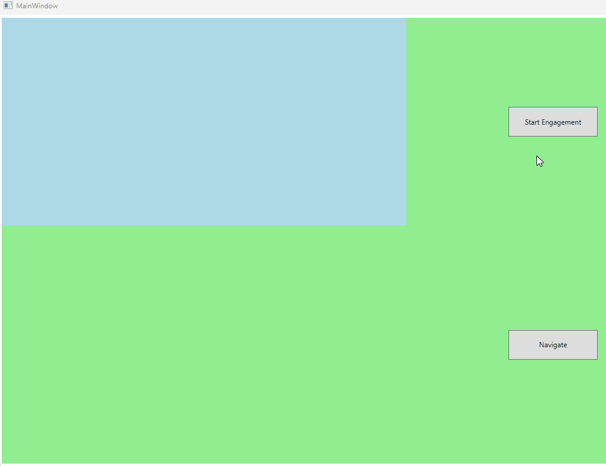

# How to show Gainsight PX engagements with WebView2 control in .NET applications

### .NET version 8.0
Install the SDK - https://dotnet.microsoft.com/en-us/download/dotnet/8.0

### Required packages
- [Microsoft.WebWebView2](https://www.nuget.org/packages/Microsoft.Web.WebView2/1.0.2210.55)
- [Newtonsoft.Json](https://www.nuget.org/packages/Newtonsoft.Json/13.0.1)
- Gainsight PX SDK 1.3.8 (or later version)
  - Download the SDK [here](https://support.gainsight.com/PX/API_for_Developers/SDKs/Gainsight_PX_C_SDK)
  - Copy `GainsightPX.dll` to `GainsightWpfApp\GainsightPX\GainsightPX` directory
  - Copy `GainsightPX.WPF.dll` to `GainsightWpfApp\GainsightPX\GainsightPX.WPF` directory

### Build and run the .NET WPF application

- Open [`GainsightWpfApp`](GainsightWpfApp) with Visual Studio 2022 or Visual Studio Code
- Set your product key and your user ID in [`GainsightConstants.cs`](GainsightWpfApp/GainsightConstants.cs)
- [`WebView2`](https://learn.microsoft.com/en-us/dotnet/api/microsoft.web.webview2.wpf.webview2) is the browser control that shows the engagement html contents
- [`MainWindow.ReferenceControl`](GainsightWpfApp/MainWindow.xaml) is a `Grid` that is used as a reference to position the web control
  - If you don't set a reference control via `Gainsight.Client.SetEngagementReference()`, Gainsight will use the main application window as the reference
- Build and run the application
  - The _Navigate_ button shows how to navigate to a web page using an instance of `WebView2` control
  - The _Start Engagement_ button shows how to display Gainsight PX engagement with `WebView2`

